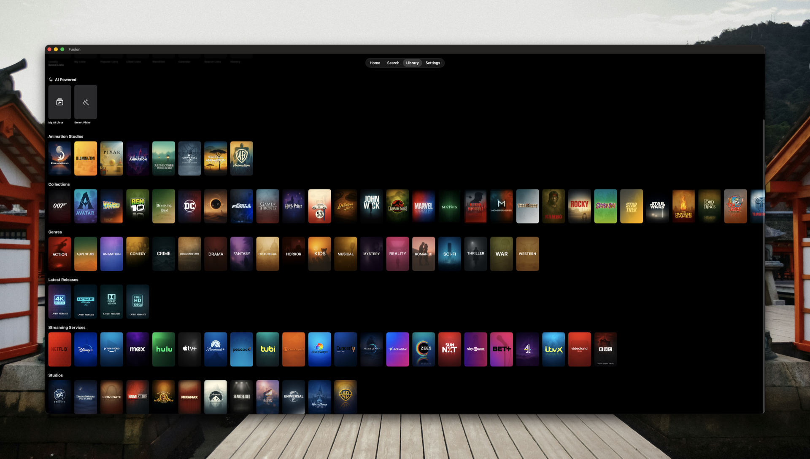
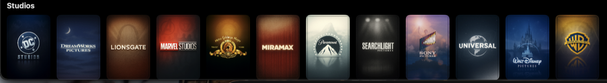
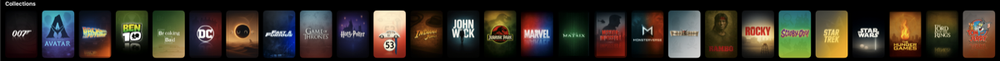
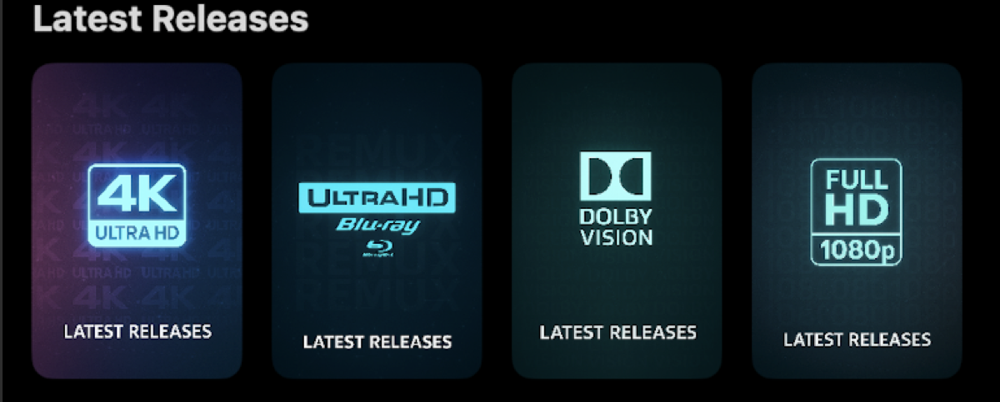
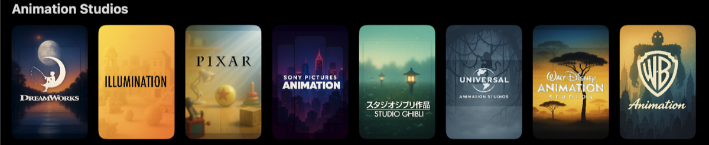
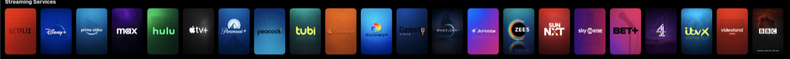
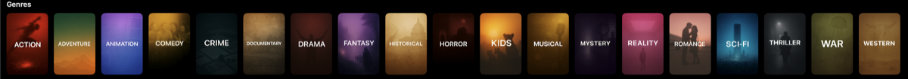

# Fusion App Content

A curated collection of custom posters and resource filters for the [Fusion](https://apps.apple.com/app/fusion-media-library-manager/id6741428023) media library manager.



## 📥 Quick Install

### 📁 Folders
**Settings → Folders → Import Folders from URL**

| Category | Import URL |
|----------|------------|
| Animation Studios | `https://raw.githubusercontent.com/Yakuza2635/fusion_app-content/main/folders/posters/animation/posters-animation.json` |
| Collections | `https://raw.githubusercontent.com/Yakuza2635/fusion_app-content/main/folders/posters/collections/posters-collections.json` |
| Genres | `https://raw.githubusercontent.com/Yakuza2635/fusion_app-content/main/folders/posters/genres/posters-genres.json` |
| Lists | `https://raw.githubusercontent.com/Yakuza2635/fusion_app-content/main/folders/posters/lists/posters-lists.json` |
| Releases | `https://raw.githubusercontent.com/Yakuza2635/fusion_app-content/main/folders/posters/releases/posters-releases.json` |
| Streaming Services | `https://raw.githubusercontent.com/Yakuza2635/fusion_app-content/main/folders/posters/streaming/posters-streaming.json` |
| Studios | `https://raw.githubusercontent.com/Yakuza2635/fusion_app-content/main/folders/posters/studios/posters-studios.json` |

### 🔍 Resource Filters
**Settings → Resource Filters → Import from URL**

| Category | Import URL |
|----------|------------|
| Filters | `https://raw.githubusercontent.com/Yakuza2635/fusion_app-content/main/resource-filters/filters/filters.json` |

---

## 📦 What's Included

### 📁 Folders (107 posters)

| Category | Count | Description |
|----------|-------|-------------|
| Animation Studios | 8 | DreamWorks, Pixar, Studio Ghibli, Disney Animation, and more |
| Collections | 37 | Popular franchises: MCU, DC, Star Wars, Harry Potter, LOTR, and more |
| Genres | 19 | Action, Comedy, Drama, Horror, Sci-Fi, and more |
| Lists | 2 | Top Rated Movies, Popular Movies |
| Releases | 4 | Latest 4K, Full HD, 4K Remux, Dolby Vision releases |
| Streaming Services | 25 | Netflix, Disney+, Prime Video, HBO Max, and more |
| Studios | 12 | Warner Bros, Universal, Paramount, Marvel Studios, and more |

### 🔍 Resource Filters (65 filters)

| Group | Count | Items |
|-------|-------|-------|
| 📀 Media Source | 10 | Remux T1-T3, Bluray T1-T3, Web T1-T3, Web Scene |
| 📺 Resolution | 3 | 4K/2160p, 1080p, 720p |
| 🌈 Dynamic Range | 5 | Dolby Vision, HDR10+, HDR10, HDR, SDR |
| 🔊 Audio | 8 | Dolby Atmos, TrueHD, DTS-X, DTS-HD MA, DTS-HD, DD+, DTS, DD |
| 🔉 Audio Channels | 3 | 7.1, 6.1, 5.1 |
| 🌐 Languages | 36 | English, Spanish, French, German, Japanese, Portuguese (Brazil) 🇧🇷, Portuguese (Portugal) 🇵🇹, and 29 more |

---

## 📸 Screenshots

| Animation Studios | Collections | Genres |
|-------------------|-------------|--------|
|  |  |  |

| Studios | Streaming Services | Releases |
|---------|-------------------|----------|
|  |  |  |

---

## 📂 Repository Structure

```
fusion_app-content/
├── folders/
│   └── posters/
│       ├── animation/
│       │   └── posters-animation.json
│       ├── collections/
│       │   └── posters-collections.json
│       ├── genres/
│       │   └── posters-genres.json
│       ├── lists/
│       │   └── posters-lists.json
│       ├── releases/
│       │   └── posters-releases.json
│       ├── streaming/
│       │   └── posters-streaming.json
│       └── studios/
│           └── posters-studios.json
│
├── resource-filters/
│   └── filters/
│       └── filters.json
│
├── screenshots/
├── README.md
└── LICENSE
```

---

## 🙏 Credits

- **[iFusion Gallery](https://ifusion.netlify.app/)** - Filter posters and original configurations
- **[Vidhin05/Releases-Regex](https://github.com/Vidhin05/Releases-Regex)** - Anime release group quality tier regex patterns
- **[Fusion App](https://apps.apple.com/app/fusion-media-library-manager/id6741428023)** - The amazing media library manager

---

## 📄 License

This project is licensed under the MIT License - see the [LICENSE](LICENSE) file for details.

---

## 🤝 Contributing

Contributions are welcome! Feel free to submit a Pull Request or open an Issue.

See [CONTRIBUTING.md](CONTRIBUTING.md) for guidelines.
